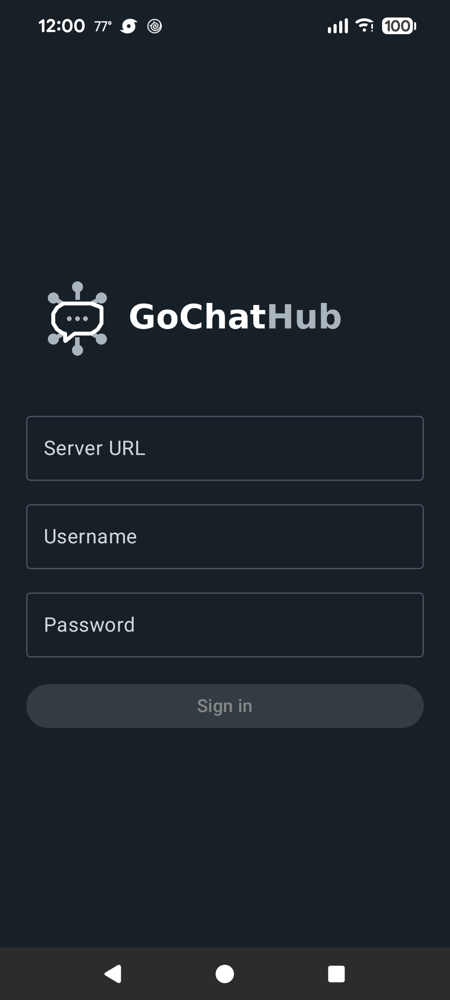
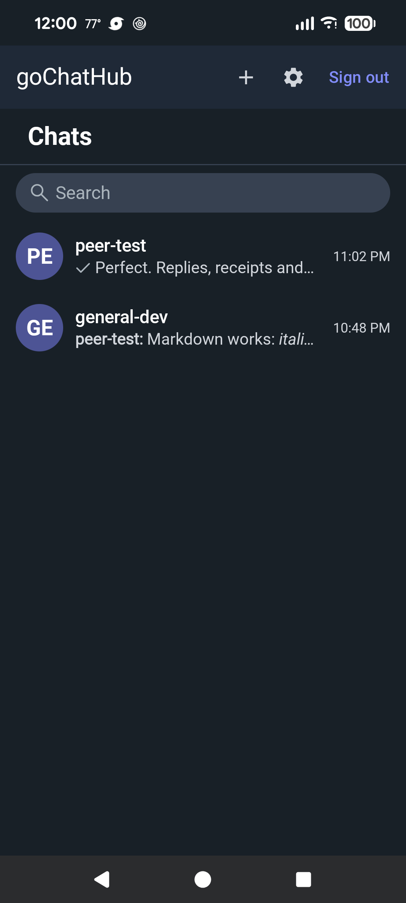
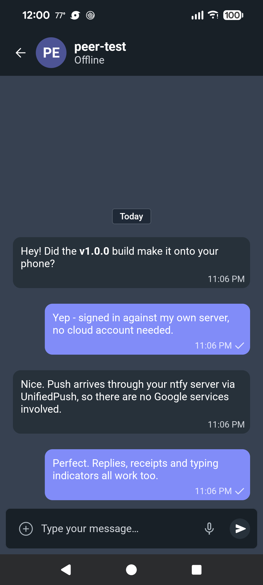
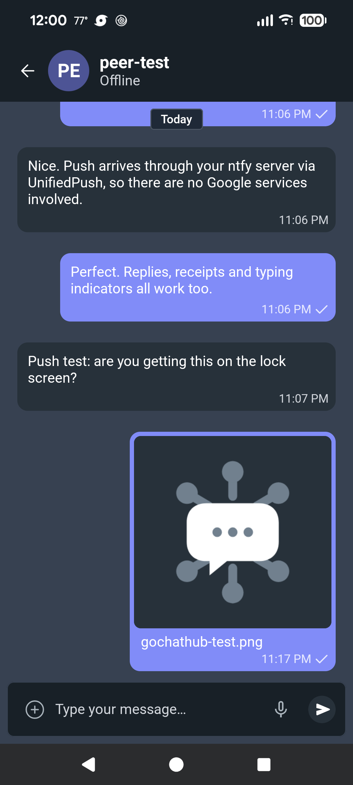
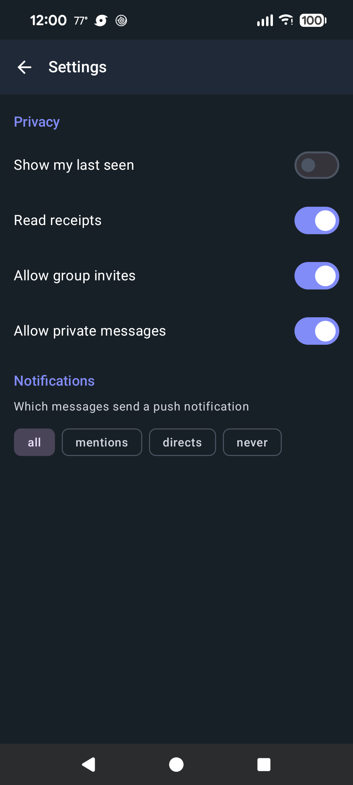

<div align="center">
  <picture>
    <source media="(prefers-color-scheme: dark)" srcset="assets/gochathub-wordmark-dark.png">
    
  </picture>

  # gochathub-android-client

  **Android client for goChatHub — CometChat UI Kit with the networking layer replaced by your own server.**

  [](LICENSE)
  [](build.gradle.kts)
  [](gradle/libs.versions.toml)
  [](app/build.gradle.kts)

</div>

`gochathub-android-client` is the Android app of [goChatHub](https://github.com/gochathub): rooms, direct messages, receipts, typing and presence over the WebSocket, attachments through presigned upload sessions, and push notifications delivered through UnifiedPush — no FCM, no third-party cloud.

It is built on the [CometChat Android UI Kit](https://github.com/cometchat/cometchat-uikit-android) (MIT) (`chatuikit-compose`). The Kit's screens, ViewModels and theme are kept; its networking layer is replaced at the Kit's datasource seam so every screen talks to a [gochathub-server](https://github.com/gochathub/gochathub-server) deployment, and the SDK model types it kept are now plain in-tree data holders (`chatuikit-core/src/main/java/com/gochathub/chat/**`) — no closed-source dependency remains, and no CometChat service is ever contacted.

- Calls/voice/video are excluded end to end ([server ADR-012](https://github.com/gochathub/gochathub-server/blob/main/docs/DECISIONS.md)); polls, stickers and AI-assistant surfaces are stripped with them — they have no server counterpart.
- Accounts come from the server's admin CLI ([ADR-014](https://github.com/gochathub/gochathub-server/blob/main/docs/DECISIONS.md)): the app ships a login form only — no signup, no password reset.

## Features

- **Session** — `POST /auth/login` with `token_request: true`, token stored with `EncryptedSharedPreferences`/Keystore; any 401 drops the app to the login screen.
- **Conversations and chat** — room list, timelines with cursor pagination, markdown messages, reactions, single-level replies.
- **Realtime** — WebSocket with subscribe/ack/read/typing frames; REST is authoritative and wins on every reconnect.
- **Push** — UnifiedPush with self-hosted ntfy: VAPID key from the server, device registration + validation-ping round trip, per-room endpoint renewals; payloads carry identifiers only and are fetched over REST before display.
- **Privacy preferences and notification modes** — wired straight to the server's enforcement (the client doesn't filter locally).
- **Receipts** — per-message delivered/read state rendered per the server's ADR-009 rules; opting out keeps you at "delivered" for others.

## Screenshots

<p align="center">
  
  
  
  
  
</p>

## Build

```bash
./gradlew assembleDebug            # app + both kit modules
./gradlew checkContract            # snapshot vs live server contract (drift guard)
./gradlew :chatuikit-core:testDebugUnitTest
```

`app/build.gradle.kts` reads a default dev server URL from the Gradle property `base_url`; the login screen takes any server URL.

Instrumented round trip (needs a reachable server and credentials):

```bash
./gradlew :app:connectedDebugAndroidTest \
  -Pandroid.testInstrumentationRunnerArguments.BASE_URL=http://… \
  -Pandroid.testInstrumentationRunnerArguments.USERNAME=… \
  -Pandroid.testInstrumentationRunnerArguments.PASSWORD=…
```

## Repository layout

| Path | Contents |
| --- | --- |
| `app/` | `com.gochathub.gochathubclient`: login, home, chat, people, invites, settings, UnifiedPush wiring |
| `chatuikit-core/` | Kit data layer + `com.cometchat.uikit.core.hub` — the GoChatHub client (REST client, WebSocket, encrypted session store, DTO↔model mappers) |
| `chatuikit-compose/` | Kit Compose screens (calls/poll/sticker/AI surfaces deleted) |
| `api/openapi.yaml` | Pinned contract snapshot; `checkContract` fails on drift |
| `docs/CLIENT_BRIEF.md` | Integration brief (the fork rules lived here first) |
| `docs/KIT_AUDIT.md` | The fork surgery audit (call-site inventory and reroute map) |
| `docs/HUB_BRIDGE.md` | Web-socket → kit ViewModel bridge reference |

## Documentation

- Server contract: [`gochathub-server/api/openapi.yaml`](https://github.com/gochathub/gochathub-server/blob/main/api/openapi.yaml) — normative; this repo pins a snapshot per commit.
- Server repo docs: [`WEBSOCKETS.md`](https://github.com/gochathub/gochathub-server/blob/main/docs/WEBSOCKETS.md), [`UNIFIEDPUSH.md`](https://github.com/gochathub/gochathub-server/blob/main/docs/UNIFIEDPUSH.md), [`DECISIONS.md`](https://github.com/gochathub/gochathub-server/blob/main/docs/DECISIONS.md).

## Contributing

PRs welcome. Keep `api/openapi.yaml` in sync with the upstream server contract (`./gradlew checkContract`), keep changes on the datasource seam (no direct server calls from UI code) and attach tests for behavior changes.

## License

[MIT](LICENSE) © Brian Tafoya

The `chatuikit-compose` and `chatuikit-core` modules are adapted from the
[CometChat Android UI Kit](https://github.com/cometchat/cometchat-uikit-android)
([MIT license](https://github.com/cometchat/cometchat-uikit-android/blob/v6/LICENSE),
© CometChat). Their sources and API docs in this repository are also
[MIT-licensed](chatuikit-core/LICENSE).